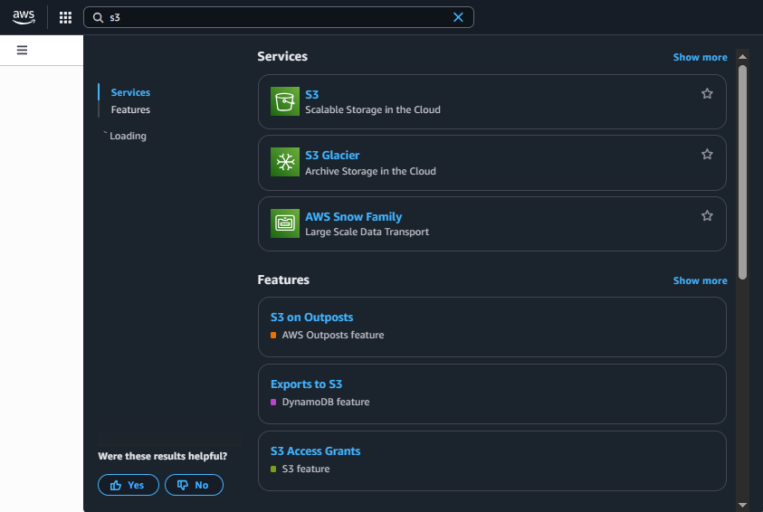
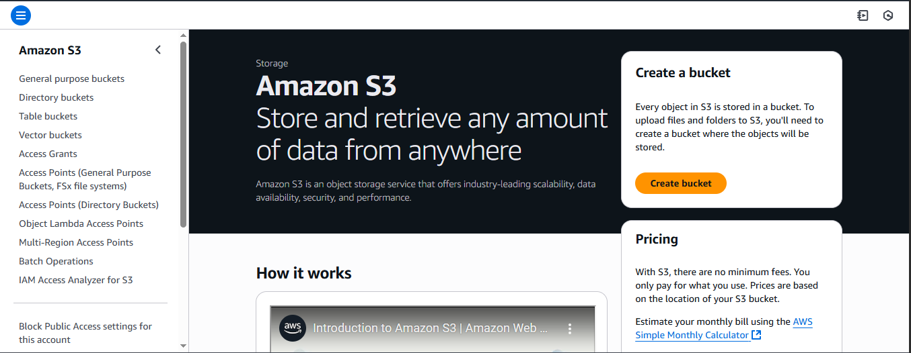
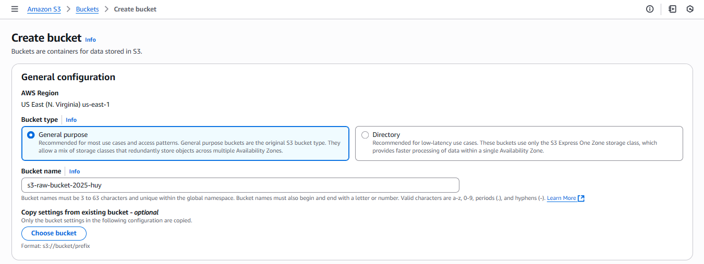
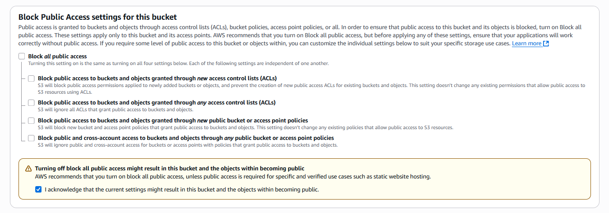
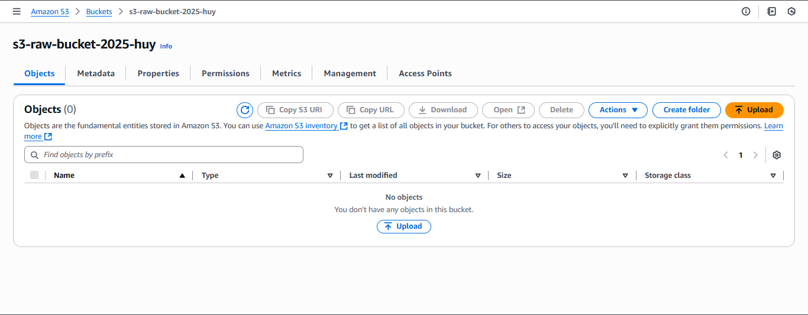
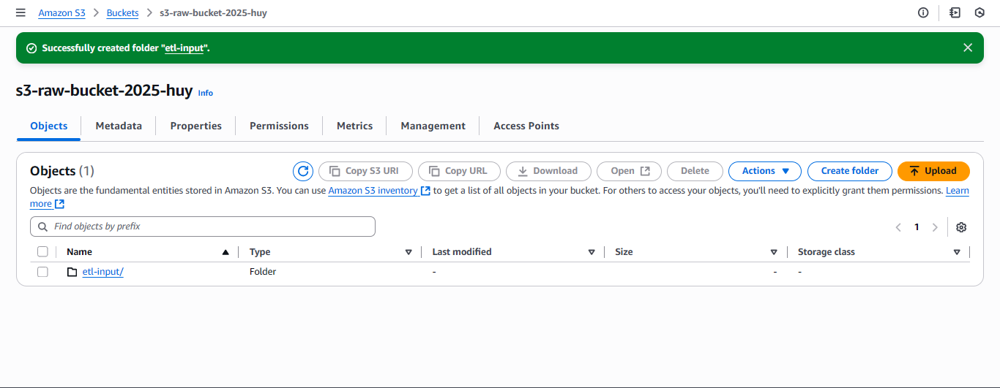
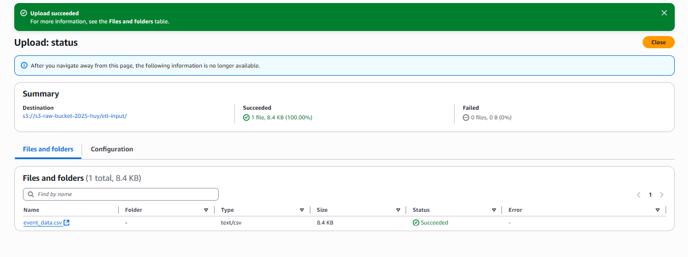
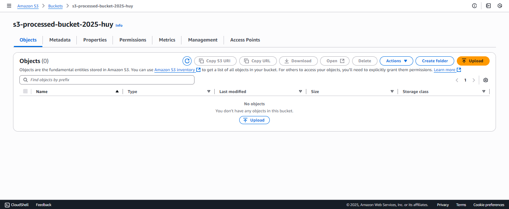

In this lab, we will create **two S3 buckets** to store the data:  
- **Raw bucket**: stores raw CSV files.  
- **Processed bucket**: stores transformed data (Parquet).  

---

### Steps to follow

1. Go to the [AWS Management Console](https://aws.amazon.com/console/).  
   - Search for **S3** and open the service.  

   

2. In the **S3 console**:
   - Select **Create bucket**.

   

   {}
   Make sure you are in the **correct AWS Region** where you plan to deploy Glue and Lambda.
   {}

3. Create the raw bucket:
   - **Bucket name**: Enter `s3-raw-bucket-2025`.

   {}  
   Bucket names must be globally unique. If there is a conflict, add a suffix such as `-yourname`.  
   {}

   

   - Uncheck **Block all public access** and confirm.
  
   
   
   - Select **Create bucket**.

4. Prepare a folder and upload data:
   - Open the bucket `s3-raw-bucket-2025`.

   

   - Select **Create folder** → enter `etl-input` → **Create folder**.

   

   - Open the `etl-input` folder → **Upload** → **Add files** → select the file `event_data.csv`.  
     > 📥 [Download the sample file here](/files/event_data.csv)
   - Select **Upload** and wait until the status shows **Succeeded**.

   

5. Create the processed bucket in the same way:  
   - Go back to the bucket list.  
   - Select **Create bucket**.  
   - **Bucket name**: `s3-processed-bucket-2025`.  
   - Uncheck **Block all public access** → **Create bucket**.  

   

   {}  
   There is no need to create folders or upload files for the processed bucket — Glue will create them automatically when the job runs.  
   {}
