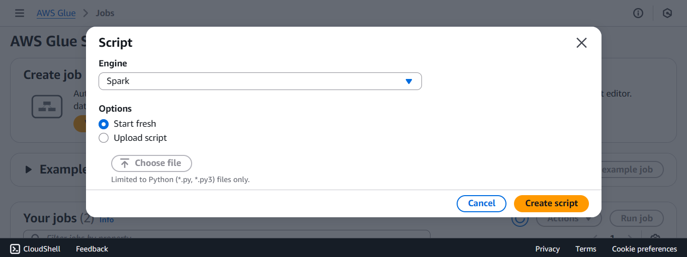

In this step, you will create a Glue Job to transform data from the **raw** bucket to the **processed** bucket, and then validate the output in S3.

### Steps

1. **Open Glue Console**  
  - Go to [AWS Glue Console](https://console.aws.amazon.com/glue/home?region=us-east-1).  
  - Select **ETL Jobs** → **Script editor**.  

  
  
  - **Engine**: `Spark`
  - Click **Create script**

2. **Paste Glue Script**  
  - Open the **Script** tab.  
  - Delete the default content and paste the following script:

  ```python
  import sys
  from awsglue.transforms import *
  from awsglue.utils import getResolvedOptions
  from pyspark.context import SparkContext
  from awsglue.context import GlueContext
  from awsglue.job import Job
  from awsglue.dynamicframe import DynamicFrame
  from pyspark.sql.functions import when, col, lit
  from pyspark.sql.types import IntegerType, FloatType, TimestampType

  args = getResolvedOptions(sys.argv, ['JOB_NAME', 'input_path'])
  output_path = args.get('output_path', 's3://s3-processed-bucket-2025/transformed/')

  sc = SparkContext()
  glueContext = GlueContext(sc)
  spark = glueContext.spark_session
  job = Job(glueContext)
  job.init(args['JOB_NAME'], args)

  datasource = glueContext.create_dynamic_frame.from_options(
      format_options={"withHeader": True},
      connection_type="s3",
      format="csv",
      connection_options={"paths": [args['input_path']], "recurse": True},
  )
  df = datasource.toDF()

  if "participant_count" in df.columns:
      df = df.withColumn("participant_count", col("participant_count").cast(IntegerType()))
  if "ticket_revenue" in df.columns:
      df = df.withColumn("ticket_revenue", col("ticket_revenue").cast(FloatType()))
  if "event_date" in df.columns:
      df = df.withColumn("event_date", col("event_date").cast(TimestampType()))

  numeric_columns = [c for c, t in df.dtypes if t.startswith(('int','double','float')) and c in ['participant_count','ticket_revenue']]
  status_column = next((c for c in ['ticket_revenue','participant_count'] if c in numeric_columns), None)

  def transform_df(df):
      if status_column:
          return (
              df.withColumn("temp_value", when(col(status_column).isNotNull(), col(status_column).cast("float")))
                .withColumn("status", when(col("temp_value").isNotNull() & (col("temp_value") > 0), "completed").otherwise("cancelled"))
                .drop("temp_value")
          )
      else:
          return df.withColumn("status", lit("unknown"))

  transformed_df = transform_df(df)
  transformed_dynamic_frame = DynamicFrame.fromDF(transformed_df, glueContext, "transformed_data")

  glueContext.write_dynamic_frame.from_options(
      frame=transformed_dynamic_frame,
      connection_type="s3",
      connection_options={"path": output_path},
      format="parquet"
  )
  job.commit()
```

3. **Configure the Job**

  * Open the **Job details** tab.
  * **Name**: `TransformRawDataJob`
  * **IAM Role**: `AWSGlueServiceRole-RawDataCrawler`
  * **Type**: `Spark`
  * **Glue version**: `4.0`
  * **Language**: `Python 3`
  * **Worker type**: `G 2X`
  * **Requested number of workers**: `10`
  * **Generate job insights**: OFF
  * **Generate job insights**: OFF
  * **Continuous logging**: ON
  * **Spark UI**: OFF
  * **Maximum concurrency**: `2`
  * Trong phần **Job parameters**:
    | Key | Value |
    |-----|-------|
    | --cloudwatch-log-group | /aws-glue/jobs/logs-v2 |
    | --job-bookmark-enable | true |
  * Click **Save**.