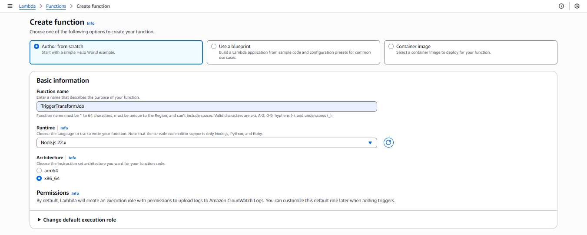

In this step, we will create a Lambda function `TriggerTransformJob` to **automatically trigger the Glue Job** `TransformRawDataJob` whenever a new CSV file is uploaded into `s3://s3-raw-bucket-2025/etl-input/`.

---

### 1. Download sample Lambda file:

👉 [Click here to download the .zip file](/files/lambda-trigger-transform.zip)

This file contains pre-built source code with the following logic:

- Receive event from S3 (bucket + object key).
- Call `glue.startJobRun` with the parameter `--input_path` set to the newly uploaded CSV file path.
- Print out the Glue job `JobRunId` for monitoring.

---

### 2. Create Lambda Function

1. Open [AWS Lambda Console](https://us-east-1.console.aws.amazon.com/lambda/home?region=us-east-1).
2. Select **Create function** → **Author from scratch**:

   - **Function name**: `TriggerTransformJob`
   - **Runtime**: `Node.js 22.x`

   

   - **Execution role**: expand **Change default execution role** → select **Use an existing role** → `LambdaTriggerRole` (created in step 2.2).

   

   - Click **Create function**.

3. In the **Code** tab, select **Upload from → .zip file** → choose the `.zip` file you just downloaded → click **Deploy**.

---

### 3. Add S3 Trigger

1. Go to **Configuration → Triggers → Add trigger**.
2. Select **S3**:

   - **Bucket**: `s3-raw-bucket-2025`
   - **Event type**: `All object create events`
   - **Prefix**: `etl-input/`
   - **Suffix**: `.csv` (optional, to only catch CSV files)
   - Check the acknowledgment box for costs → **Add**.

   

---

### 4. Test Lambda with a Test Event

You can test directly in the Lambda console by creating a **Test event** with the following content:

```json
{
  "Records": [
    {
      "s3": {
        "bucket": {
          "name": "s3-raw-bucket-2025"
        },
        "object": {
          "key": "etl-input/event_data.csv"
        }
      }
    }
  ]
}
```

When running the test, Lambda will print out the new JobRunId of the Glue job `TransformRawDataJob`.

---

### 5. Verify the Entire Pipeline

1. Upload a real CSV file (e.g., `etl-input/sales.csv`) to `s3://s3-raw-bucket-2025/etl-input/`.
2. Lambda will be triggered automatically and call the Glue job.
3. Go to **Glue → Jobs → TransformRawDataJob** to view the new run.
4. Once the Glue job finishes, check the results in `s3://s3-processed-bucket-2025/transformed/`.

---

### 6. Notes

- If Lambda is not triggered, check **S3 Event Notifications** and the Lambda IAM permissions.
- If Lambda fails when calling Glue, verify that the role `LambdaTriggerRole` has the `glue:StartJobRun` policy.
- Lambda should **only call the start job** and exit; the actual data processing is handled by Glue.
