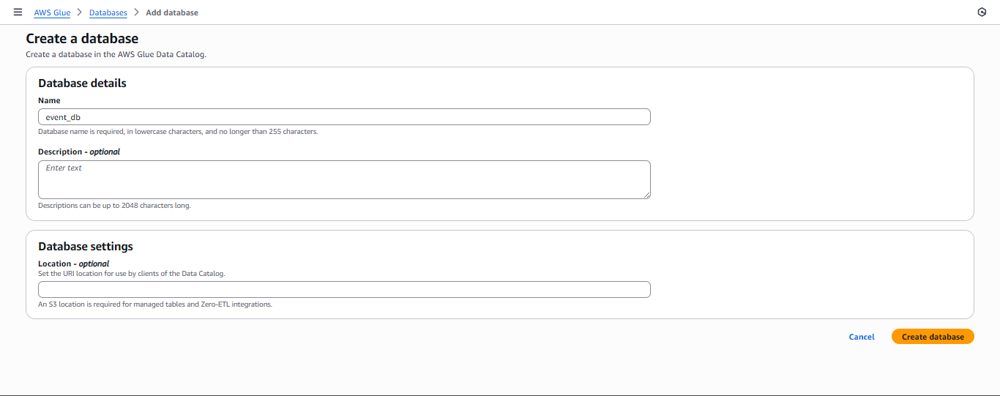
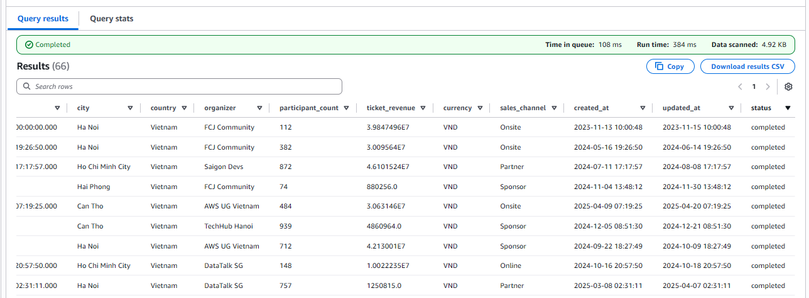

After the data has been transformed and stored as **Parquet** in S3, you can use **Amazon Athena** to query it.

### 1. Create Database
   - Click **Create database**.  
   - Enter the name: `event_db`.  
   
   

   - Click **Create**.

### 2. Create Glue Crawler

1. Open [AWS Glue Console](https://us-east-1.console.aws.amazon.com/glue/home?region=us-east-1).  
2. Select **Crawlers → Create crawler**.  
3. Enter the crawler name: `event-crawler` → **Next**.  
4. **Data source**:  
   - Choose **Add a data source**  
   - Data source: `S3`  
   - S3 path: `s3://s3-processed-bucket-2025/transformed/`  
   - Click **Add an S3 data source** → **Next**.  
5. **IAM role**: `AWSGlueServiceRole-ProcessedDataCrawler` (created in step 2.2) → **Next**.  
6. **Target database**: `event_db`.  
7. **Table prefix**: can be left empty or enter `event_` → **Next**.  
8. Review and click **Create crawler**.  

### 3. Run Glue Crawler

1. Select the crawler `event-crawler` → **Run crawler**.  
2. Once completed, go to the **Tables** tab in the Glue Console.  
- You will see a new table (e.g., `event_table`) created based on the schema from the Parquet file.  


---

### 4. Query Data with Athena

1. Open [Athena Console](https://us-east-1.console.aws.amazon.com/athena/home?region=us-east-1).  
2. In the Query Editor:  
- **Data source**: `AwsDataCatalog`  
- **Database**: `event_db`  
3. Run a sample query:

```sql
SELECT * 
FROM event_db.event_table 
LIMIT 20;
````



- The result displays the transformed data from the Glue job.
- In this result, there will be an additional status field to check data of completed or canceled events.
    

---

### 5. Notes

- If the table is not visible, check:
    
    - The S3 output path (`s3://s3-processed-bucket-2025/transformed/`).
        
    - Whether the Glue Crawler ran successfully.
        
- Glue Crawler automatically detects the Parquet format and schema (columns, data types).
    
- You can re-run the crawler when new data with a different schema arrives.