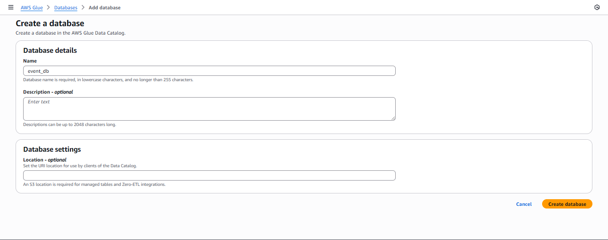

Sau khi dữ liệu đã được chuyển đổi và lưu dưới dạng **Parquet** trong S3, bạn có thể dùng **Amazon Athena** để truy vấn.

### 1. Tạo Database
   - Chọn **Create database**.
   - Nhập tên: `event_db`.
   
   
   
   - Nhấn **Create**.  

### 2. Tạo Glue Crawler

1. Mở [AWS Glue Console](https://us-east-1.console.aws.amazon.com/glue/home?region=us-east-1).  
2. Chọn **Crawlers → Create crawler**.  
3. Nhập tên crawler: `event-crawler` → **Next**.
4. **Data source**:  
   - Chọn **Add a data source**
   - Data source: `S3`
   - S3 path: `s3://s3-processed-bucket-2025/transformed/`
   - Chọn **Add an S3 data source** → **Next**.
5. **IAM role**: `AWSGlueServiceRole-ProcessedDataCrawler` (tạo ở bước 2.2) → **Next**.
6. **Target database**: `event_db`.
7. **Table prefix**: có thể để trống hoặc nhập `event_` → **Next**.
8. Review và **Create crawler**.

### 3. Chạy Glue Crawler

1. Chọn crawler `event-crawler` → **Run crawler**.  
2. Sau khi hoàn tất, vào tab **Tables** của Glue Console.  
- Bạn sẽ thấy bảng mới (ví dụ: `event_table`) được tạo ra dựa trên schema từ file Parquet.  


---

### 4. Truy vấn dữ liệu với Athena

1. Mở [Athena Console](https://us-east-1.console.aws.amazon.com/athena/home?region=us-east-1).  
2. Trong Query Editor:  
- **Data source**: `AwsDataCatalog`  
- **Database**: `event_db`  
3. Chạy thử truy vấn:

```sql
SELECT * 
FROM event_db.event_table 
LIMIT 100;
```


- Kết quả hiển thị dữ liệu đã transform từ Glue job.
- Trong kết quả sẽ có thêm trường status để check dữ liệu các sự kiện đã hoàn thành hay hủy.

    
---

### 4. Lưu ý

- Nếu chưa thấy bảng, hãy kiểm tra lại:
    - Đường dẫn S3 output (`s3://s3-processed-bucket-2025/transformed/`).
    - Glue Crawler đã chạy thành công.     
- Glue Crawler sẽ tự động nhận diện định dạng Parquet và schema (cột, kiểu dữ liệu).
- Bạn có thể chạy lại crawler khi có dữ liệu mới với schema khác.