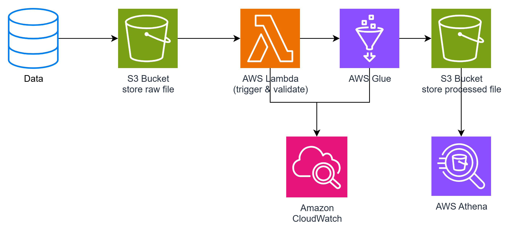

# Pipeline ETL Serverless Workshop

### Tổng quan

Workshop này hướng dẫn bạn xây dựng một **pipeline ETL (Extract, Transform, Load) Serverless** trên AWS để theo dõi và phân tích doanh thu từ các sự kiện cộng đồng.

Pipeline này sẽ **tự động hóa toàn bộ quá trình xử lý dữ liệu** từ nhiều nguồn, giúp tối ưu chi phí, tăng tốc phân tích và giảm rủi ro lỗi thủ công.

Workshop bao gồm các bước thực hành cụ thể, từ chuẩn bị hạ tầng đến kiểm thử và dọn dẹp tài nguyên, giúp bạn áp dụng ngay vào thực tế như: phân tích dữ liệu sự kiện, lập báo cáo tài chính hoặc dashboard trực quan.

### Nội dung

1. [Giới thiệu](1-introduce/)
2. [Chuẩn bị môi trường và hạ tầng](2-prerequiste/)
3. [Triển khai và kiểm tra pipeline](3-deployment/)
4. [Giám sát và xử lý lỗi](3-monitor-and-error-handling/)
5. [Kiểm thử](5-testing/)
6. [Dọn dẹp tài nguyên](6-cleanup/)
